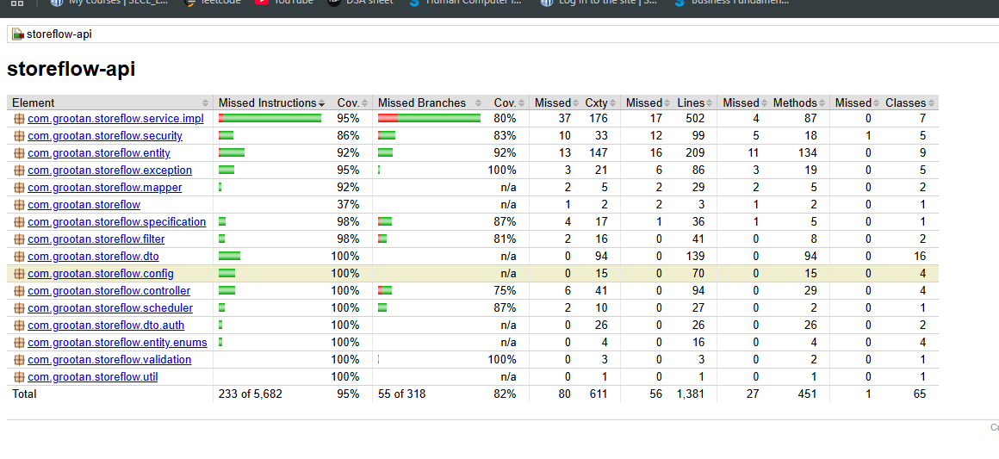
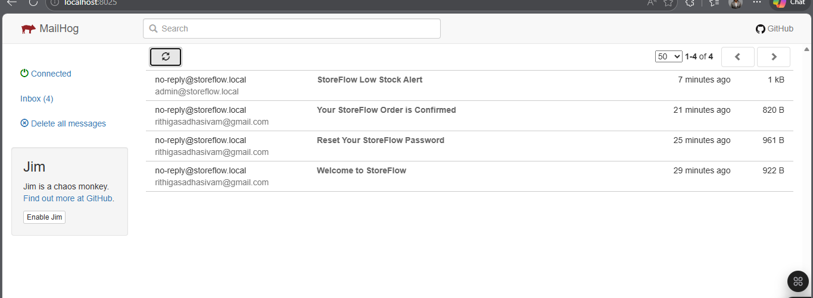
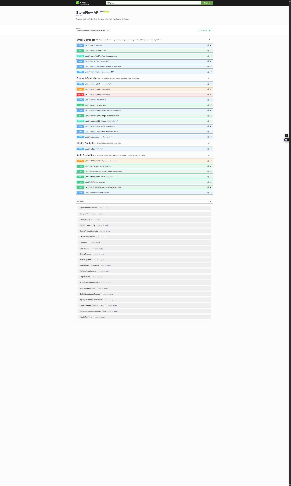

# StoreFlow API

StoreFlow API is a production-ready Spring Boot backend application designed for managing products, orders, authentication, and real-time notifications.

---

## Tech Stack

- Spring Boot 3
- PostgreSQL
- Spring Data JPA / Hibernate
- Flyway
- Spring Security
- JWT Authentication
- JUnit, Mockito, MockMvc
- WebSocket (STOMP)
- Swagger (OpenAPI)
- Spring Boot Actuator
- Micrometer
- Maven

---

## Features

- Authentication and Authorization using JWT
- Product Management APIs
- Order Management APIs
- File Upload and Download
- PDF Report Generation
- CSV Export
- Real-time Notifications
- Pagination (Offset + Cursor)
- Email Notifications
- Monitoring and Metrics
- High Test Coverage

---

## Phase-wise Implementation

---

#### Phase 1 – Project Setup

- Spring Boot project initialized
- PostgreSQL configuration
- Application configuration setup
- Basic project structure
- Health endpoint implemented

---

#### Phase 2 – Data Layer

- Entities created:
    - User
    - Category
    - Product
    - Order
    - OrderItem
    - ShippingAddress
    - RefreshToken
    - PasswordResetToken

- JPA relationships configured
- Repository layer implemented

---

#### Phase 3 – Service and Controller Layer

- Service layer implemented
- Controllers implemented

Product APIs:
- Create product
- Get products
- Update product
- Delete product

Order APIs:
- Place order
- Get orders
- Get order by ID
- Update order status

Business logic:
- Stock deduction
- Order total calculation

Testing:
- Integration tests for core flows

---

#### Phase 4 – Authentication and Security

- Signup
- Login
- Refresh Token
- Forgot Password / Reset Password

JWT:
- Access token
- Refresh token

Security:
- Spring Security configuration
- SecurityFilterChain
- JwtAuthenticationFilter

Role-based authorization:
- USER
- ADMIN

Endpoints:
- Protected and public APIs
- /api/auth/me

Database:
- Flyway migrations for:
    - refresh_tokens
    - password_reset_tokens

Testing:
- Unit tests
- Integration tests

---

#### Phase 5 – Validation and Error Handling

Validation:

- Jakarta Bean Validation added
- @Valid used in controllers

Product validation:
- Name (3–150 characters)
- SKU uppercase alphanumeric + hyphen
- Price positive
- Stock quantity non-negative
- Category ID required

Auth validation:
- Full name validation
- Email validation
- Password validation

Order validation:
- Shipping fields required
- Quantity minimum 1
- Postal code validation

Custom Validator:

- @ExistsCategory
- ExistsCategoryValidator

Error Handling:

- AppException base class

Custom exceptions:
- ResourceNotFoundException
- InsufficientStockException
- InvalidStatusTransitionException
- AuthenticationFailedException
- StoreFlowAccessDeniedException

GlobalExceptionHandler handles:
- MethodArgumentNotValidException
- DataIntegrityViolationException
- JwtException
- AuthenticationException
- AccessDeniedException
- Generic exceptions

ErrorResponse includes:
- timestamp
- status
- error
- message
- path
- errors map

Testing:

Unit tests:
- AppException subclasses
- ExistsCategoryValidator
- GlobalExceptionHandler
- ErrorResponse

Integration tests:
- Invalid product input
- Duplicate SKU conflict
- Invalid auth input
- Invalid order input
- Status transition validation

---

#### Phase 6 – File Handling and Reports

- Product image upload and download
- Max file size: 5MB
- Allowed formats: JPEG, PNG, WEBP

User Avatar:

- /api/auth/me/avatar

PDF Report:

- /api/orders/{id}/report

CSV Export:

- /api/orders/export

Testing:

- File validation tests
- PDF generation tests
- CSV export tests

---

#### Phase 7 – Advanced Features

WebSocket:

- STOMP + JWT authentication
- /topic/orders/{id}/status
- Real-time order updates

Pagination:

- Offset pagination
- Cursor pagination
- Sorting and filtering

Testing:

- Pagination edge cases
- Cursor logic
- Exception flows

---

#### Phase 8 – Production Readiness

Email Notifications:

- Welcome email
- Password reset email
- Order confirmation email
- Low-stock alert
- Daily digest scheduler

Production Hardening:

- Structured logging
- GZIP compression
- Environment configs
- Graceful shutdown

Monitoring:

- /actuator/health
- /actuator/metrics
- /actuator/prometheus

Metrics:

- Order count
- Revenue
- Average order value

Testing:

- EmailService tests
- Scheduler tests
- Integration tests

Coverage:

- Line coverage ~90%+
- Branch coverage ~80%+

---

## Screenshots

Add screenshots here:

- Test Coverage: 
- Email Service: 
- Swagger UI:  

---


-- Swagger UI:

http://localhost:8080/swagger-ui/index.html

Authentication

Use Swagger Authorize with:

Bearer <access_token>

## Running the Application

```bash
mvn clean install
mvn spring-boot:run

## testing
mvn test
mvn verify  ->to check test coverage